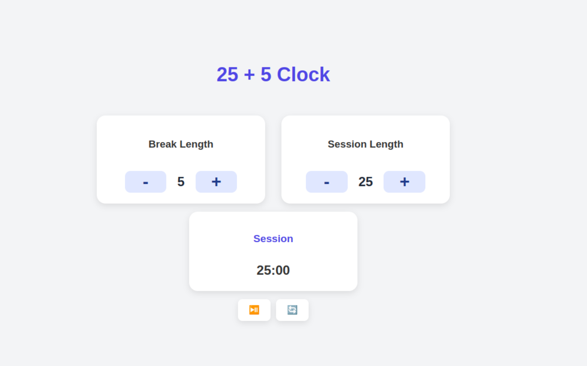

# 25 + 5 Clock (Pomodoro Timer)

Une application de minuterie 25 + 5 développée avec **React + TypeScript**, respectant les spécifications de freeCodeCamp. Elle permet de gérer des sessions de travail et des pauses, en suivant la méthode Pomodoro.

## Fonctionnalités

- Réglage de la durée des **sessions de travail** (1 à 60 minutes)
- Réglage de la durée des **pauses** (1 à 60 minutes)
- Démarrage / pause du minuteur
- Réinitialisation complète des valeurs à l'état initial
- Affichage dynamique du temps restant au format `mm:ss`

## Aperçu

 

## Installation

1. **Cloner le dépôt**
   ```bash
   git clone https://github.com/ton-nom-utilisateur/clock.git
   cd clock
   ```

2. **Installer les dépendances**
   ```bash
   npm install
   ```

3. **Démarrer le projet**
   ```bash
   npm run dev
   ```

L'application sera accessible sur `http://localhost:5173`.

## Technologies utilisées

- [React](https://reactjs.org/)
- [TypeScript](https://www.typescriptlang.org/)
- [CSS Modules](https://github.com/css-modules/css-modules)

## Histoires utilisateur implémentées (freeCodeCamp)

- [x] Le minuteur commence à la valeur affichée dans `#session-length`
- [x] Il est possible d'ajuster la durée des sessions et pauses
- [x] Le bouton Start/Stop contrôle le fonctionnement du timer
- [x] Le bouton Reset remet toutes les valeurs à zéro
- [x] Changement automatique vers la pause après la session (à implémenter)
- [x] Signal sonore à la fin de chaque période (à implémenter)


## Auteur

Développé par **eadarak00**  


> Ce projet fait partie du **certificat Frontend Libraries** de freeCodeCamp.
